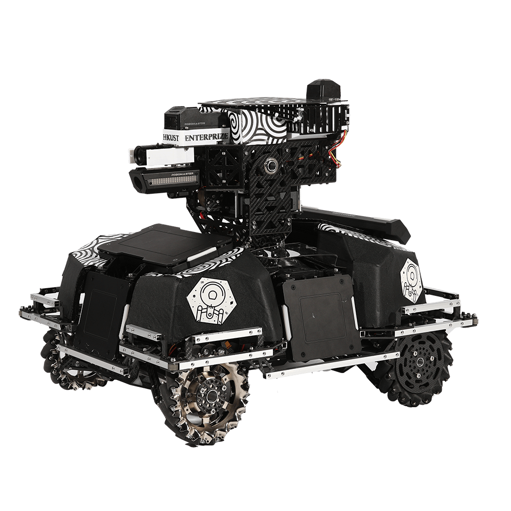
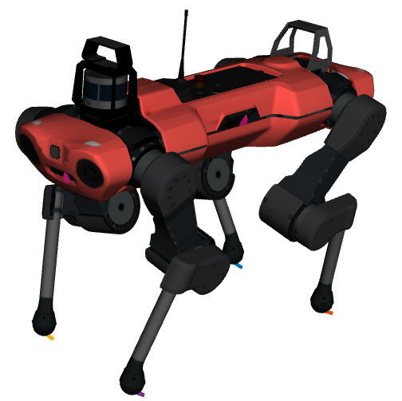

### Hey there

 

I'm FU Zhengyu, a senior undergraduate from [The Hong Kong University of Science and Technology](https://hkust.edu.hk/) majoring in [Integrative Systems and Design](https://isd.hkust.edu.hk/), with a dual major in [Computer Engineering](http://www.cpeg.ust.hk/). In the summer of 2022, I was a Robotics Institute Summer Scholar (RISS) in the Robotic Exploration Lab at Carnegie Mellon University supervised by Prof. Zachary Manchester. Prior to that, I did my bachelor thesis in the Robotic Systems Lab (RSL) at ETH Zurich under the supervision of Prof. Marco Hutter and Dr. Farbod Farshidian.

I am a __Robot Enthusiast__ 🤖  with a particular interest for __model-based__ and __optimization-based__ control of agile robotics systems.

You might want to check my personal website at [fu-zhengyu.xyz](http://fu-zhengyu.xyz)
